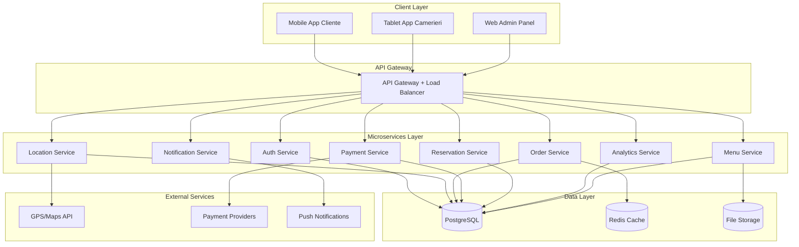

# Design Document - Garçon App

## Overview

Garçon è un ecosistema completo per la digitalizzazione del servizio ristorativo composto da tre componenti principali:
1. **App Mobile Cliente** (iOS/Android) - per ordinare, chiamare camerieri e pagare
2. **App Tablet Camerieri** - per gestire ordini e chiamate in tempo reale  
3. **Pannello Web Amministrativo** - per proprietari per gestire menu, analytics e impostazioni

Il sistema utilizza un'architettura cloud-native con microservizi per garantire scalabilità, affidabilità e performance ottimali.

## Architecture

### High-Level Architecture



### Technology Stack

**Frontend:**
- **Mobile App**: React Native (iOS/Android)
- **Tablet App**: React Native (ottimizzata per tablet)
- **Web Admin**: React.js con TypeScript
- **State Management**: Redux Toolkit
- **UI Framework**: React Native Elements / Material-UI

**Backend:**
- **Runtime**: Node.js con TypeScript
- **Framework**: Express.js con Helmet per sicurezza
- **API Gateway**: Kong o AWS API Gateway
- **Authentication**: JWT con refresh tokens
- **Real-time**: Socket.io per notifiche live

**Database & Storage:**
- **Primary DB**: PostgreSQL per dati transazionali
- **Cache**: Redis per sessioni e cache
- **File Storage**: AWS S3 per immagini menu
- **Search**: Elasticsearch per ricerca locale/menu

**Infrastructure:**
- **Cloud**: AWS (ECS/Fargate per containers)
- **CDN**: CloudFront per asset statici
- **Monitoring**: CloudWatch + Sentry
- **CI/CD**: GitHub Actions

## Components and Interfaces

### 1. Authentication Service

**Responsabilità:**
- Gestione registrazione/login clienti
- Autenticazione proprietari locali
- Gestione sessioni e token JWT
- Controllo accessi basato su ruoli

**API Endpoints:**
```typescript
POST /auth/register
POST /auth/login
POST /auth/refresh
POST /auth/logout
GET /auth/profile
PUT /auth/profile
```

### 2. Location Service

**Responsabilità:**
- Identificazione automatica locale via GPS
- Gestione database locali partner
- Validazione tavoli per locale
- Gestione zone di copertura

**API Endpoints:**
```typescript
GET /locations/nearby?lat={lat}&lng={lng}
GET /locations/{locationId}/tables
POST /locations/{locationId}/checkin
GET /locations/{locationId}/info
```

### 3. Menu Service

**Responsabilità:**
- Gestione menu per locale
- Upload e ottimizzazione immagini
- Categorizzazione articoli
- Sincronizzazione real-time modifiche

**API Endpoints:**
```typescript
GET /menu/{locationId}
POST /menu/{locationId}/items
PUT /menu/{locationId}/items/{itemId}
DELETE /menu/{locationId}/items/{itemId}
POST /menu/{locationId}/items/{itemId}/image
```

### 4. Order Service

**Responsabilità:**
- Gestione carrello e ordini
- Coordinamento ordini di gruppo
- Tracking stato ordini
- Gestione note personalizzate

**API Endpoints:**
```typescript
POST /orders
GET /orders/{orderId}
PUT /orders/{orderId}/status
GET /orders/table/{tableId}
POST /orders/{orderId}/items
DELETE /orders/{orderId}/items/{itemId}
```

### 5. Payment Service

**Responsabilità:**
- Integrazione provider pagamento multipli
- Gestione pagamenti separati gruppo
- Elaborazione rimborsi
- Generazione ricevute

**API Endpoints:**
```typescript
POST /payments/process
GET /payments/{paymentId}/status
POST /payments/{paymentId}/refund
GET /payments/methods
POST /payments/split
```

### 6. Notification Service

**Responsabilità:**
- Push notifications real-time
- Gestione chiamate cameriere
- Notifiche stato ordini
- Sistema di priorità messaggi

**WebSocket Events:**
```typescript
// Client -> Server
'waiter-call'
'order-placed'
'payment-completed'

// Server -> Client
'waiter-response'
'order-status-update'
'table-notification'
```

### 7. Reservation Service

**Responsabilità:**
- Gestione prenotazioni tavoli
- Controllo disponibilità
- Sistema recensioni e valutazioni
- Integrazione calendario locale

**API Endpoints:**
```typescript
POST /reservations
GET /reservations/{locationId}/availability
PUT /reservations/{reservationId}
POST /reviews/{locationId}
GET /reviews/{locationId}
```

### 8. Analytics Service

**Responsabilità:**
- Raccolta metriche utilizzo
- Generazione insights business
- Report personalizzati
- Dashboard real-time

**API Endpoints:**
```typescript
GET /analytics/{locationId}/dashboard
GET /analytics/{locationId}/reports
GET /analytics/{locationId}/popular-items
GET /analytics/{locationId}/peak-hours
```

## Data Models

### Core Entities

```typescript
// User Model
interface User {
  id: string;
  email: string;
  name: string;
  phone?: string;
  role: 'customer' | 'owner' | 'waiter';
  createdAt: Date;
  updatedAt: Date;
}

// Location Model
interface Location {
  id: string;
  name: string;
  address: string;
  coordinates: {
    latitude: number;
    longitude: number;
  };
  ownerId: string;
  settings: LocationSettings;
  subscriptionTier: 'free' | 'premium';
  isActive: boolean;
}

// Table Model
interface Table {
  id: string;
  locationId: string;
  number: string;
  capacity: number;
  isActive: boolean;
  currentSession?: TableSession;
}

// TableSession Model
interface TableSession {
  id: string;
  tableId: string;
  participants: SessionParticipant[];
  startTime: Date;
  endTime?: Date;
  isActive: boolean;
}

// SessionParticipant Model
interface SessionParticipant {
  id: string;
  sessionId: string;
  userId?: string;
  fantasyName: string;
  joinedAt: Date;
  orders: Order[];
}

// MenuItem Model
interface MenuItem {
  id: string;
  locationId: string;
  name: string;
  description: string;
  price: number;
  category: string;
  imageUrl?: string;
  allergens: string[];
  isAvailable: boolean;
  customizations: MenuCustomization[];
}

// Order Model
interface Order {
  id: string;
  sessionId: string;
  participantId: string;
  items: OrderItem[];
  status: 'pending' | 'confirmed' | 'preparing' | 'ready' | 'delivered';
  notes?: string;
  totalAmount: number;
  createdAt: Date;
  updatedAt: Date;
}

// OrderItem Model
interface OrderItem {
  id: string;
  menuItemId: string;
  quantity: number;
  unitPrice: number;
  customizations: string[];
  notes?: string;
}

// Payment Model
interface Payment {
  id: string;
  orderId: string;
  amount: number;
  method: 'card' | 'google_pay' | 'apple_pay' | 'paypal' | 'satispay';
  status: 'pending' | 'completed' | 'failed' | 'refunded';
  transactionId?: string;
  createdAt: Date;
}

// Reservation Model
interface Reservation {
  id: string;
  locationId: string;
  userId: string;
  tableId?: string;
  partySize: number;
  reservationTime: Date;
  status: 'confirmed' | 'cancelled' | 'completed';
  specialRequests?: string;
}

// Review Model
interface Review {
  id: string;
  locationId: string;
  userId: string;
  orderId?: string;
  rating: number; // 1-5
  comment?: string;
  createdAt: Date;
}
```

## Error Handling

### Error Response Format
```typescript
interface ErrorResponse {
  error: {
    code: string;
    message: string;
    details?: any;
    timestamp: string;
    requestId: string;
  };
}
```

### Error Categories

**Client Errors (4xx):**
- `INVALID_REQUEST` - Dati richiesta malformati
- `UNAUTHORIZED` - Token mancante/invalido
- `FORBIDDEN` - Accesso negato per ruolo
- `NOT_FOUND` - Risorsa non esistente
- `VALIDATION_ERROR` - Validazione dati fallita

**Server Errors (5xx):**
- `INTERNAL_ERROR` - Errore generico server
- `SERVICE_UNAVAILABLE` - Servizio temporaneamente non disponibile
- `PAYMENT_ERROR` - Errore elaborazione pagamento
- `EXTERNAL_SERVICE_ERROR` - Errore servizio esterno

### Retry Logic
- Implementazione exponential backoff per chiamate API
- Circuit breaker pattern per servizi esterni
- Fallback graceful per funzionalità non critiche

## Testing Strategy

### Unit Testing
- **Coverage Target**: 80% minimum
- **Framework**: Jest per backend, Jest + React Native Testing Library per frontend
- **Focus**: Logica business, validazioni, trasformazioni dati

### Integration Testing
- **API Testing**: Supertest per endpoint REST
- **Database Testing**: Test containers con PostgreSQL
- **External Services**: Mock per payment providers e GPS

### End-to-End Testing
- **Mobile**: Detox per React Native
- **Web**: Cypress per admin panel
- **Scenarios**: User journey completi (ordine → pagamento)

### Performance Testing
- **Load Testing**: Artillery.js per API endpoints
- **Stress Testing**: Simulazione picchi di traffico
- **Database Performance**: Query optimization e indexing

### Security Testing
- **Authentication**: Test JWT validation e refresh
- **Authorization**: Verifica controlli accesso
- **Input Validation**: Test injection attacks
- **Payment Security**: PCI DSS compliance testing

## Security Considerations

### Authentication & Authorization
- JWT tokens con scadenza 15 minuti
- Refresh tokens con rotazione automatica
- Role-based access control (RBAC)
- Rate limiting per endpoint sensibili

### Data Protection
- Crittografia dati sensibili at-rest (AES-256)
- TLS 1.3 per comunicazioni
- Tokenizzazione dati pagamento
- GDPR compliance per dati personali

### API Security
- Input validation e sanitization
- SQL injection prevention
- CORS policy restrittiva
- API versioning per backward compatibility

### Infrastructure Security
- VPC con subnet private per database
- WAF per protezione DDoS
- Secrets management con AWS Secrets Manager
- Regular security audits e penetration testing

## Scalability & Performance

### Horizontal Scaling
- Microservices containerizzati con Docker
- Auto-scaling basato su CPU/memoria
- Load balancing con health checks
- Database read replicas per query intensive

### Caching Strategy
- Redis per sessioni utente e menu cache
- CDN per asset statici e immagini
- Application-level caching per query frequenti
- Cache invalidation intelligente

### Database Optimization
- Indexing strategico per query performance
- Connection pooling per efficienza
- Query optimization e monitoring
- Partitioning per tabelle grandi (orders, analytics)

### Real-time Performance
- WebSocket connection pooling
- Message queuing per notifiche batch
- Geographical load balancing
- Edge computing per latenza ridotta